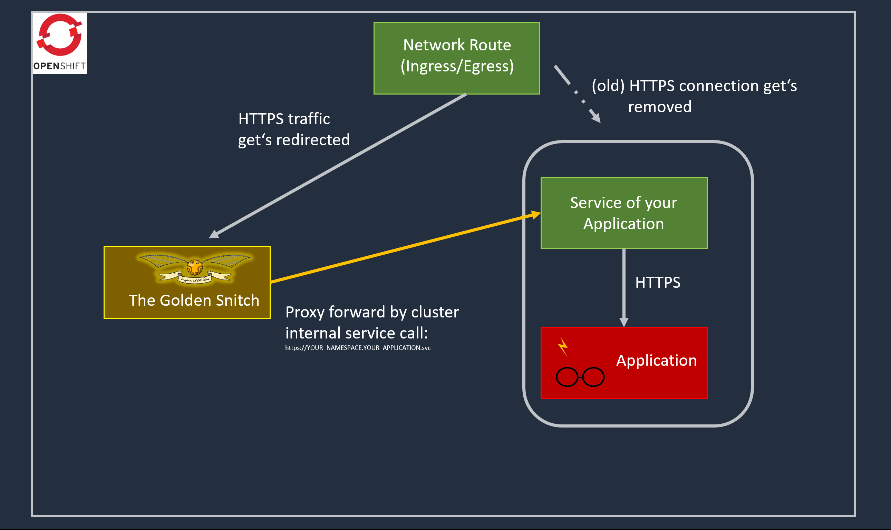

[](https://github.com/BenjiTrapp/golden-snitch/actions/workflows/docker-publish.yml)
[](https://github.com/BenjiTrapp/golden-snitch/actions/workflows/blank.yml)
[](https://github.com/BenjiTrapp/golden-snitch/actions/workflows/checkov.yaml)

<p align="center">

</p>

This tool can be used for good or bad things and comes with two use cases dedicated to two of the four houses of Hogwarts:

### Gryffindor

Someone is eating your headers? Not sure if all requests and responses are sent correctly towards your application? The golden snitch is here to rescue you. This friendly snitch can be used to proxy all the traffic without dealing with lousy Horkuxes like  an init- or sidecar container.

Like playing with the [Marauder's Map](https://harrypotter.fandom.com/wiki/Marauder%27s_Map) a simple spell `echo "Mischief managed" && oc delete -l app.kubernetes.io/name=golden-snitch` is enough to stop the snitch.

<br>
<br>

### Slytherin


Like a snake in the shadow you want to plan your next actions and snitch your target to optimize your attack. The golden snitch can be used to proxy your victims apllication and wait until valuable is coming across like a Token, Auth-Bearer Header or something else. Since this can be applied into your OpenShift and gain HTTPS certificates from your cluster it will be easy to trap muggles and lousy mages. No one will ever know that you can understand their cyphered secret language.

<br>
<br>
<br>
<br>

<p align="left">

### Heyho - let's go

##### Prerequisites: oc client, helm, a openshift cluster and optional a dockerhub account

To get started with this tool simply adjust the values in the `values.yaml`. All required fields are marked. Use the upcoming snippet to render the helm chart and apply it to the cluster. If you haven't installed the oc client, now is a good time to install it:

```bash
helm template . | tee snitch.yaml | oc apply -f -
```

### Behind the magic

To understand the magic, let's take a look inside the spell book:

<p align="center">

</p>

On OpenShift there is a fancy [feature](https://docs.openshift.com/container-platform/4.9/security/certificates/service-serving-certificate.html) that allows you to serve a certificate as a secret as long as a service is defined. This certificate is trusted and created by your cluster. This helps us to break up the HTTPS connection between the Route and the vicitims application. Either the application nor the muggels who are calling the application will know that you're watching their traffic.

Additional the golden snitch is a proxy we can capture the incoming traffic and redirect it to the victim application. In that way the golden snitch will be less invasive and can be opted in and out with ease.

### Now some words of warning and disclaimer: 
I'm not responsible for any harm caused by this tool. Also the nginx might leak some headers and info, for a well trained admin it shouldn't be a big deal to silence it. For script kiddies > sorry but it's better to keep it that way then :) 
</p>

---

<p align="center">

</p>
